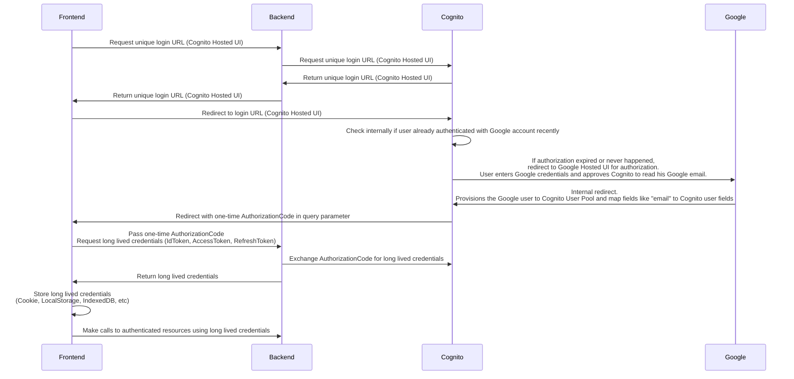

## Overview

## Technology Stack

- Frontend
  - language: typescript
  - styling: tailwindcss
  - library: react
  - build tool: vite

# Appendix

https://github.com/awesome-cdk/cognito-google-federation-example
