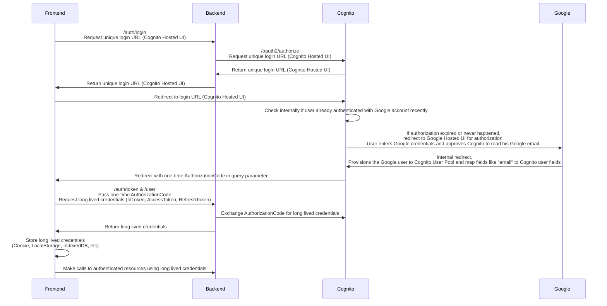

## Overview

## 技術スタック

- Frontend
  - language: typescript
  - styling: tailwindcss
  - library: react
  - build tool: vite
- Backend
  - language: nodejs(typescript)
- infrastructure
  - AWS

## AWS 環境構築

- [AWS 環境構築](./readme-docs/environment.md)

## 参考情報

- 参考にしたソースコード: https://github.com/awesome-cdk/cognito-google-federation-example
- ユーザープールのフェデレーションエンドポイント: https://docs.aws.amazon.com/ja_jp/cognito/latest/developerguide/federation-endpoints.html
- ユーザープールにソーシャルサインインを追加する: https://docs.aws.amazon.com/ja_jp/cognito/latest/developerguide/cognito-user-pools-configuring-federation-with-social-idp.html
