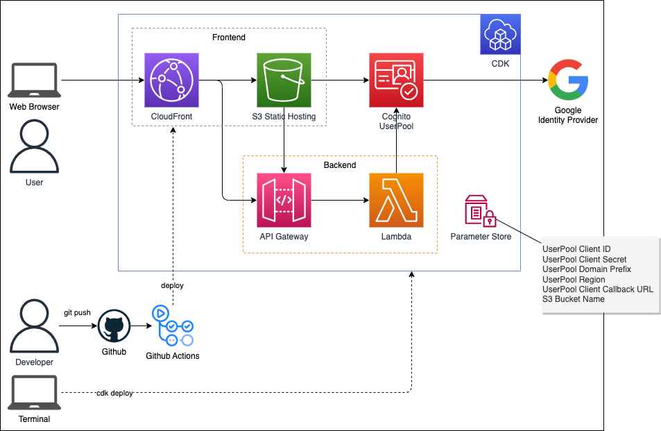

## AWS アーキテクチャ



## Google Cloud プラットフォーム の設定

[Google 開発者コンソール](https://console.developers.google.com/) に移動して、新しいプロジェクトを作成する。

プロジェクト作成後、API とサービスを開いたら「認証情報」と「OAuth 同意画面」を設定する。


### OAuth 同意画面

承認済みドメインに「`amazoncognito.com`」を設定する。


### 認証情報

OAuth クライアント ID を作成する。


「承認済みの JavaScript 生成元」に `Google 認証後のリダイレクト先` の HTTP オリジンを入力する。今回は localhost と CloudFront のドメインを使用する。

「承認済みのリダイレクト URI」に以下のルールで URI を入力する。（[参考](https://docs.aws.amazon.com/ja_jp/cognito/latest/developerguide/cognito-user-pools-configuring-federation-with-social-idp.html)）

- `https://[UNIQUE_PREFIX].auth.[AWS_REGION].amazoncognito.com/oauth2/idpresponse`

UNIQUE_PREFIX - 主に Cognito のホスト型 UI ドメイン名のプレフィックスとして使用されるグローバルで一意なプレフィックス。


## AWS 構築

```
npm install
npx cdk deploy --require-approval never \
    --context prefix=[UNIQUE_PREFIX] \
    --context google-client-id=[GOOGLE_CLIENT_ID] \
    --context google-client-secret=[GOOGLE_CLIENT_SECRET] \
    --profile [YOUR-PROFILE]
```
